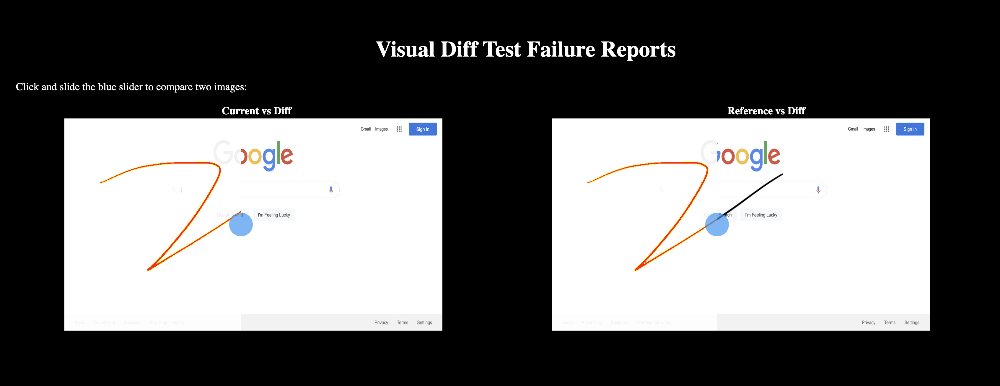

# Visual tests using WebdriverIO - pixelmatch

This project is to create a simplified Visual diff tests using webdriver IO and pixelmatch.


[](LICENSE)
[](https://www.ruby-lang.org/en/)
[]( https://stackoverflow.com/users/10505289/naresh-sekar )
[](CONTRIBUTING.md)
[](mailto:nareshnavinash@gmail.com)

# 


## Supports
* Multi browser automation
* Modes of run via CLI command
* Headless run
* Custom crafted UI diff html report
* Allure reports
* Jenkins Integration
* CircleCI Integration
* Docker Execution
* Failed Screenshots
* Tagging the tests
* Retries of failed tests
* Parallel Run
* ESLinter adapted


## Setup
* Clone this repository
* Navigate to the cloned folder
* Install node and npm using `brew install node`
* Install the dependencies with respect to this project by `npm install`


## To Run the tests

To run all the tests, one can try
```
npm run test
```
This will run all the tests that matches `/test/*.spec.js`

To update the baseline images which is stored in `/test/referenceImages/`
```
npm run test -- snap
```
This will update the baseline images with the currently displayed image.

### Parallel run
If you have multiple specs to run at a time, one can specify the number of threads that can be open in a single run through,
```
threads=2 npm run test
```
In ideal case, one can open upto two browsers in headless mode with 1GB RAM. By default the thread value is set to 1, based on machine capacity one can decide to increase the threads.

### Headless run
To run the tests in headless mode,
```
headless=true npm run test
```
By default headless mode is forced if we run the tests in OS other than MAC and Windows. In Mac and Windows if you need to run the tests in headless mode then you can specify from the commandline as above.

### Multi-Browser run
To run the tests in a specific browser,
```
browser=chrome npm run test
browser=firefox npm run test
```
if no browser option is specified, chrome is forced by default. We can combine all the above modes of run by setting up the environment variable either from command line or while building a docker image.

### Running specific tests
In order to run specific tests,
```
npm run test -- --mochaOpts.grep "sanity"
```
This is achieved by leveraging mocha's CLI option, one can specify any string (in the place of 'sanity') to run that specific tests.

### Tagged run
Mocha doesn't provide any explicit option to specify tags for each tests, we are trying to leverage the above `Mocha's grep` CLI to achieve the tagging functionality. In each test description one has to specify whether the test is sanity or regression or both sanity & regression like,

```
describe('Enter Details in workspace form and cancel -> regression', () => {
    // Test description
}

// or

describe('Create a new Personal Workspace -> regression, sanity', () => {
    // Test description
}
```
So, To run the tests based on the tags, we can directly use `npm run test -- --mochaOpts.grep "sanity"` or `npm run test -- --mochaOpts.grep "regression"`.


## Reports
For better illustration on the testcases, allure report has been integrated. Allure reports can also be integrated with jenkins to get a dashboard view. Failed screenshots will be automatically attached to the allure report. Apart from allure, JSON & Junit reports I have built a custom crafted html report sample of which can be seen in `/sample_report/index.html`. 


![caption] (https://user-images.githubusercontent.com/27988169/111067887-551c5300-84ec-11eb-93f6-4de1c9240816.mp4)


### Allure
To open the allure results,
```
npm run report
```
To get this command working, make sure allure commandline is installed in your machine or allure plugin in case of jenkins.

## Retries
By default retry is set to 1 in this framework, upon need one can change this default value by changing `var runTimeRetries = process.env.retry || 1` line in the wdio.conf.js file. WebdriverIO has multiple retry options at each test level that can be seen [here](https://webdriver.io/docs/retry.html)

## Linters
ESLint has been integrated with this project structure. This helps in maintaining common code structure when multiple people involved in working with the same base code. To check the linter errors, one can run `npm run lint`. Unlike linters in other languages ESLint provides an option to fix the errors automatically, this can be invoked by using `npm run lint -- --fix`.

## CircleCI Integration
This repo has been integrated with CircleCI to validate the linter check as well as run the tests in both chrome and firefox browser. All the configurations is specified in `circleci/config.yml`. I have taken a small docker image with 2GB RAM to run the tests. This is sufficient to run two parallel executions at a time.

### Issues faced with CircleCI Integration
* There are N number of docker images available for `circleci/node` selecting a single tag which will be sufficient to run all the tests took some time. All the iterations has been done with trial and error method with different docker images and finally settled with `circleci/node:dubnium-buster-browsers-legacy` image.
* In the docker while I run the tests, I found that `setValue()` doesn't clear the existing value and set a new value, but it appends the values to the existing values. Even if we give explicit `clearValue()` the values are not cleared.
* Seems that clearValue() is already reported [here](https://github.com/webdriverio/webdriverio/issues/1140#issuecomment-663979205) and got the workaround and have that method in `page.js` file. This workaround involved in sending backspace keys untill all the texts has been cleared from the text area.

## Jenkins Integration with Docker images
Get any of the linux with node docker image as the slaves in jenkins and use the same for executing the UI automation with this framework (Sample docker image - [Circle CI Node Docker Image with browsers](https://hub.docker.com/layers/circleci/node/dubnium-buster-browsers-legacy/images/sha256-eae98971c3073d77706eac5f04e0a568eac8806187f848043f66f5b9e23f763c?context=explore). From the jenkins bash Execute the following to get the testcases to run,
```
#!/bin/bash -l
npm list
ls
cd <path_to_the_project>
npm install
npm run test <or custom run option>
```

In Jenkins pipeline, try to add the following snippet to execute the tests,
```
pipeline {
    agent { docker { image 'circleci/node:dubnium-buster-browsers-legacy' } }
    stages {
        stage('build') {
            steps {
                sh 'cd project/'
                sh 'npm install'
                sh 'npm run test' # or custom methods
            }
        }
    }
}
```

## Breakdown in to testcases

### Adding page methods to the project

1. Add page specific methods inside the `pages` folder structure. Name the page files with `<spec_name>.pages.js` so that we wont get confused with the file functionality. All the page files extends to the Page class, where we can hold any common methods that are needed across the page files.

```
class Toast extends Page {
  get toastTitle() {return $('.pm-toast-title');}

  isDisplayed() {
    this.toastBody.waitForExist(30000);
    return this.toastBody.isExisting();
  }
}
```

### Adding visual validation

To make it simple and efficient a single line within tests will do the magic and one can feel light while scripting. Having the line `ImageUtils.compare(<Name>, <threashold>);` will take care of the image comparison from the base image and will take care the image updation if we run the tests with `-- snap` command. Threshold value is to ignore false faliures due to glitch in the browsers, or OS or with the snapshot images which often used to occur in the real time.

```
describe('Google Tests', () => {
  before(() => {
    // browser.navigateTo(config.url);
  });

  describe('google search page', () => {
    it('Validate the google search page', () => {
      browser.navigateTo(config.url);
      HomePage.isDisplayed();
      ImageUtils.compare('homepage', 0.1);
      ImageUtils.compare('secondhomepage', 0.1);
    });
  });
});
```

### Adding locator methods to the project 

1. Add locators inside the page file. For static locator one can use the getter method and declare the values as 

```
get toastTitle() {return $('.pm-toast-title');}
```

2. For dynamic locator, we need to declare them as a method and call them within the page functions as,

```
// Declare
newWorkspaceTypeToggle(text) {return $('.pm-toggle-switch__item=' + text);}

// Use
this.newWorkspaceTypeToggle(type).click();
```

### Creating a new spec file in the project

Spec files are generally crafted according to our needs, but few of the common practices are,

* Have a global `describe` in your spec file which describes your spec file as a whole.
* Have a sub `describe` to describe your current test case
* Have multiple `it` inside the describe file, this ensures that proper error message is thrown if the tests are failed
* Have all the assetions with custom message, since `expected: true, actual: false` default messages are not much helpful.
* This will ensure that the allure reports as well will have a proper structure.

## Built With

* [WebdriverIO](https://webdriver.io/) - To support browser actions
* [Mocha](https://mochajs.org/) - Core Test Framework
* [Chai](https://www.chaijs.com/) - Assertion Library
* [Allure](https://www.npmjs.com/package/@wdio/allure-reporter) - For Detailed reporting.

## Contributing

1. Clone the repo!
2. Create your feature branch: `git checkout -b my-new-feature`
3. Commit your changes: `git commit -am 'Add some feature'`
4. Push to the branch: `git push origin my-new-feature`
5. Create a pull request.

Please read [CONTRIBUTING.md](CONTRIBUTING.md) for details on code of conduct, and the process for submitting pull requests.

## Authors

* **[Naresh Sekar](https://github.com/nareshnavinash)**

## License

This project is licensed under the GNU GPL-3.0 License - see the [LICENSE](LICENSE) file for details

## Acknowledgments

* To all the open source contributors whose code has been referred in this project.
